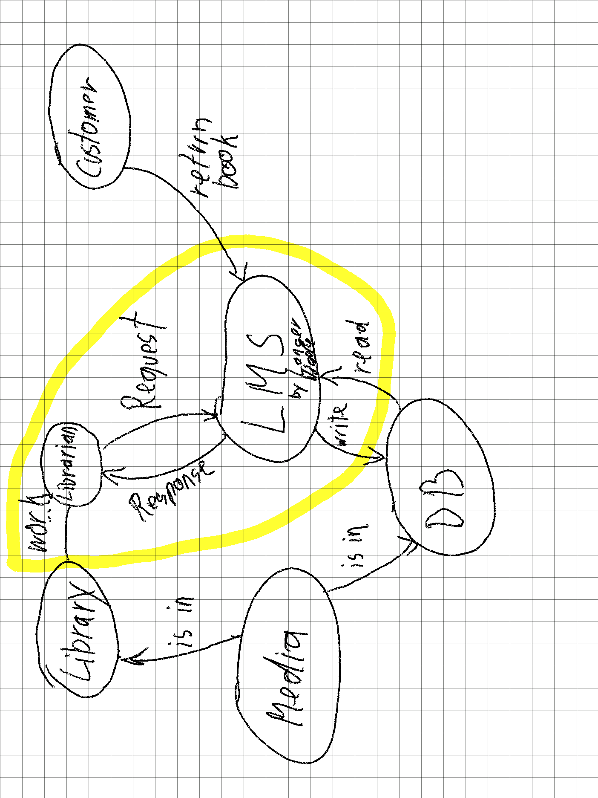

# Assignment 01 Project Settings

By Moritz Langer, Sandra Nägele

## Project Setting

- Current situation: what is the baseline of the project? Why and from which context is the project started?
  - New Library Management System for improved handling
  - starting at 0
- Project goals: find measureable goals of the project. Try to convince your management that this project is valueable for the company.
  - System with:
    - Media Management (rent, return, add, remove media)
    - Customer Management (add, remove customers; grouping)
    - Billing Custumers
    - Library Management (Blueprint; Return Clients)
    - **replacement of old system**
- Non project goals: what is out of scope of this project?
  - Database implementation
  - Media acquisition
  - hardware implementation
- List of stakeholders: identify roles with a legitimate interest in the project. Formulate the main interest of the different roles in 1-2 sentences.
*Legitimate Interest in project due to:*
  - Library owner *cost saving / better overview*
  - Librarian *time saving / easier handling*
  - Customers *fast and fluent UX*
    - adult *easy to understand no complex tasks*
    - children
    - students

## Context diagram

- Identify neighbouring "systems"
- What kind if input/output is going to be exchanged with these systems
- Don't forget to draw the context border

## Requirements

- Functional requirements: What should the system do?
  - Create the library with all medias
  - Create customers
  - Assign medias to customers
  - Compute billing for customers
- Non-functional requirements (NFR): How should the system fulfill its tasks? Identify 2-3 NFRs and make them measureable.
  - stable (99,5% of all requests end positivly, less than 1 crash per 1000h runntime)
  - maintainable (100% of functions are documented)
  - usability (40+y can use the system)
- Constraints: Is there anything within the project where you are not free to decide on?
  - DB Structure?
  - Media with specific categories, numbers
  - tracking system (id, timestamp)
  - GDPR
